# Self-Supervised Monocular Depth Estimation Using Vision Transformers

**Prasuna Chatla**

*Robotics Institute, Carnegie Mellon University*

## Abstract

This project investigates self-supervised monocular depth estimation using a hybrid architecture that combines a Vision Transformer encoder with a multi-scale convolutional decoder. The depth network predicts a dense depth or disparity map from a single RGB image. During training, adjacent video frames, a pose-estimation network, camera intrinsics, and differentiable view synthesis provide the supervisory signal without requiring ground-truth depth labels.

The implementation explores patch-based transformer encoding, convolutional depth refinement, multi-scale prediction, photometric reconstruction, Structural Similarity Index (SSIM), edge-aware smoothness, input-resolution trade-offs, transformer initialization, and bilateral filtering. The experiment record includes training-loss curves, a 500-epoch run, qualitative depth maps across diverse scene categories, and post-processing comparisons. The reported results show stable optimization in several runs and useful large-scale scene structure in the predicted maps. Metric depth accuracy is not claimed because a fixed benchmark split and standard depth metrics were not captured for these experiment runs.

---

## 1. Motivation

This project was motivated by an observation from my earlier capstone project, *Real-Time Object Detection in 3D*, where monocular depth estimation emerged as an important component of three-dimensional scene understanding.

Monocular depth estimation infers dense scene depth from a single RGB image. Supervised approaches commonly require large datasets containing RGB images paired with ground-truth depth measurements obtained from LiDAR, structured-light sensors, stereo reconstruction, or other depth-sensing systems. Acquiring such labels at scale can be expensive and difficult.

Self-supervised depth estimation derives its training signal from the geometric and photometric relationships present in unlabeled image sequences or stereo pairs. Rather than requiring depth labels during training, the model learns depth by reconstructing one view of a scene from another.

An important distinction is maintained throughout the project:

- **Inference is monocular:** the trained depth network estimates depth from one RGB image.
- **Training is self-supervised:** adjacent video frames or stereo views provide the geometry required to construct the learning objective.

### 1.1 Challenges

Depth estimation from a single image is underconstrained because different three-dimensional scenes can produce similar two-dimensional projections. The main challenges include:

- **Lack of explicit multi-view geometry:** a single image does not directly provide camera motion or stereo correspondence.
- **Scale ambiguity:** monocular observations generally do not provide absolute metric scale without additional assumptions or information.
- **Occlusion and texture ambiguity:** occluded regions, repetitive textures, reflective surfaces, and low-texture regions can make correspondence difficult.
- **Fine-detail preservation:** thin structures and object boundaries are difficult to recover when predictions are generated at reduced spatial resolution.

---

## 2. Project Objectives

The project explores the following questions:

1. Can self-attention capture global scene relationships that support monocular depth estimation?
2. Can a convolutional decoder recover dense local structure from transformer features?
3. How does multi-scale prediction affect global organization and boundary detail?
4. How do photometric reconstruction, SSIM, and edge-aware smoothness interact during training?
5. How do input resolution, model size, and transformer initialization affect convergence and memory use?
6. How does bilateral filtering change the visual quality of predicted depth maps?

---

## 3. Conceptual Overview

The model uses a Vision Transformer to encode global image context and a convolutional decoder to recover a dense depth map. During training, a separate pose network estimates the relative camera transformation between the target frame and neighboring source frames. Predicted depth, relative pose, and camera intrinsics are used to reconstruct the target view through differentiable geometric warping.

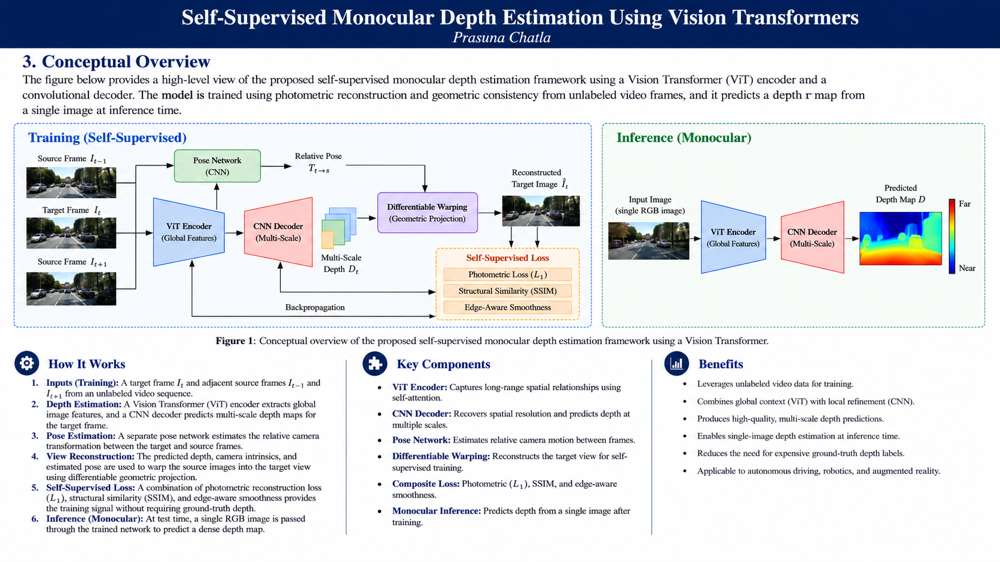

*Figure 1. Conceptual overview. The training path uses adjacent video frames, relative pose, differentiable warping, and self-supervised losses. The inference path predicts depth from a single RGB image.*

---

## 4. Self-Supervised Learning Framework

Let the target image be $I_t$ and a neighboring source image be $I_s$. The depth network predicts $D_t$ from $I_t$. The pose network predicts the relative camera transformation $T_{t\rightarrow s}$ from the target/source image pair. Given camera intrinsics $K$, the target pixels are back-projected into three-dimensional space, transformed into the source-camera coordinate system, and projected into the source image. Differentiable sampling then creates a reconstructed target image $\hat{I}_t$.

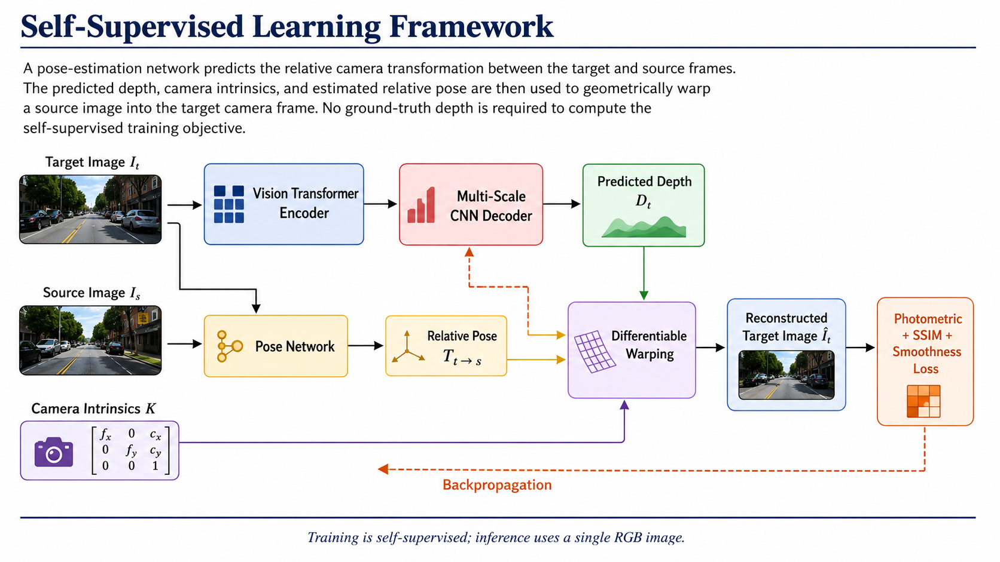

*Figure 2. Self-supervised learning framework. The depth and pose networks are optimized through target-view reconstruction. Ground-truth depth is not required for the training objective.*

Ground-truth depth, when available, is used only for quantitative evaluation.

---

## 5. Model Architecture

### 5.1 Vision Transformer Encoder

The encoder divides the input image into non-overlapping $16 \times 16$ patches. A convolutional projection converts each patch into a 768-dimensional embedding:

```text
Conv2d(
    in_channels  = 3,
    out_channels = 768,
    kernel_size  = 16,
    stride       = 16
)
```

Positional embeddings preserve the spatial location of each patch. The custom transformer configuration used in the implementation includes:

- embedding dimension: **768**
- attention heads: **8**
- transformer blocks: **6**
- MLP hidden dimension: **3072**

Each block contains layer normalization, multi-head self-attention, residual connections, and a feed-forward MLP.

### 5.2 CNN Depth Decoder

The decoder converts the reduced-resolution transformer representation into dense depth or disparity predictions. Transposed-convolution upsampling and convolutional refinement progressively recover spatial resolution.

A representative channel progression is:

```text
768 -> 256 -> 128 -> 64 -> 32 -> 1
```

The decoder includes an initial depth head and a refinement path intended to improve object boundaries, fine spatial structure, and smoothness within approximately planar regions.

### 5.3 Multi-Scale Prediction

The network predicts depth at multiple resolutions:

```text
Scale 0 -> full-resolution prediction
Scale 1 -> half-resolution prediction
Scale 2 -> quarter-resolution prediction
```

The multi-scale objective is:

$$
L_{\mathrm{multi}} = \sum_s w_s L_s,
$$

with the experimental weighting:

$$
w = [1.0,\;0.5,\;0.25].
$$

Coarse predictions encourage global scene organization, while higher-resolution predictions preserve local structure.

---

## 6. Training Objective

### 6.1 Photometric Reconstruction

For target image $I_t$ and reconstructed target image $\hat{I}_t$, the pixel reconstruction term is:

$$
L_{L1} = \left\|I_t-\hat{I}_t\right\|_1.
$$

### 6.2 Structural Similarity

SSIM provides a complementary structural comparison:

$$
L_{\mathrm{SSIM}} = \frac{1-\operatorname{SSIM}(I_t,\hat{I}_t)}{2}.
$$

The combined photometric loss is:

$$
L_{\mathrm{photo}} = \alpha L_{\mathrm{SSIM}} + (1-\alpha)L_{L1}.
$$

### 6.3 Edge-Aware Smoothness

The edge-aware regularizer encourages smooth depth within image regions while allowing discontinuities near strong image gradients:

$$
L_{\mathrm{smooth}} = |\partial_x d|e^{-|\partial_x I|} + |\partial_y d|e^{-|\partial_y I|},
$$

where $d$ is predicted disparity or normalized inverse depth.

### 6.4 Overall Loss

The combined objective is:

$$
L = L_{\mathrm{photo}} + \lambda_s L_{\mathrm{smooth}}.
$$

For multi-scale output:

$$
L_{\mathrm{total}} = \sum_s w_s\left(L_{\mathrm{photo}}^{(s)} + \lambda_s L_{\mathrm{smooth}}^{(s)}\right).
$$

---

## 7. Data Preparation and Training

### 7.1 Data

The project experiments used or considered:

- KITTI
- NYU Depth V2
- custom RGB images spanning indoor and outdoor scenes

Monodepth, Monodepth2, SfMLearner, MiDaS, Depth Anything, and PackNet-SfM are reference methods, not datasets.

### 7.2 Preprocessing and Augmentation

The experiments included resizing, normalization, random cropping, horizontal flipping, and photometric augmentation. Brightness, contrast, saturation, and limited geometric variation were explored.

For temporal self-supervised training, the same geometric transformation must be applied consistently to the target frame, source frames, and camera intrinsics. Vertical flips and large rotations are avoided for driving sequences because they can violate normal camera geometry.

### 7.3 Optimization

The recorded implementation used Adam or AdamW with a step-based learning-rate schedule. The main explored values are summarized below.

| Hyperparameter | Baseline setting | Explored range |
| --- | ---: | ---: |
| Learning rate | $1 \times 10^{-4}$ | $1 \times 10^{-5}$ to $1 \times 10^{-3}$ |
| Batch size | 8 | 4-16 |
| Training epochs | 500 | 10-800 |
| Weight decay | $1 \times 10^{-5}$ | $1 \times 10^{-6}$ to $1 \times 10^{-3}$ |
| Dropout | 0.1 | 0.0-0.5 |
| Transformer blocks | 6 | 6-24 |
| Attention heads | 8 | 4-16 |
| Embedding dimension | 768 | 256-1024 |
| Smoothness weight | 0.1 | 0.01-0.5 |
| Photometric weight | 1.0 | 0.5-2.0 |
| Random crop | 256 x 256 | 224 x 224 to 512 x 512 |
| Color-jitter strength | 0.1 | 0.05-0.3 |

The experiments were run in Google Colab Pro with an NVIDIA CUDA-capable GPU. The project notes a memory requirement of approximately 16 GB for the larger transformer configurations.

---

## 8. Experiments and Results

### 8.1 Experiment Summary

The project evaluated optimization behavior, input resolution, transformer initialization, loss composition, multi-scale prediction, qualitative generalization, and bilateral filtering.

| Experiment | Variable | Recorded outcome |
| --- | --- | --- |
| Training convergence | Multiple runs between approximately 200 and 500 epochs | Loss decreased rapidly during early training; convergence speed and residual noise varied across runs |
| Input resolution | Lower-resolution versus higher-resolution images | Higher-resolution inputs preserved more spatial detail; lower-resolution runs were less stable and sometimes required longer training |
| Transformer initialization | Pretrained versus randomly initialized ViT | Pretrained initialization accelerated convergence and produced stronger qualitative results |
| Loss composition | Individual losses versus photometric + SSIM + smoothness | The combined objective improved training stability and balanced smoothness with edge preservation |
| Smoothness weighting | Different edge-aware regularization strengths | Excessive smoothness weighting introduced artifacts or softened boundaries near strong gradients |
| Multi-scale prediction | Predictions at several spatial resolutions | Coarse scales captured broad layout while finer scales preserved more local structure |
| Bilateral filtering | Raw versus filtered prediction | Filtering reduced local variation and produced smoother maps, with some loss of fine boundary detail |
| Scene diversity | Animals, landscapes, streets, skylines, crowds, indoor scenes, repetitive patterns, and underwater images | Predicted maps retained broad foreground/background organization across varied scenes |

### 8.2 Training-Loss Convergence

Four training runs show a pronounced reduction in the optimization objective during the early epochs. Three curves approach a low plateau, while one run converges more slowly and remains comparatively noisy.

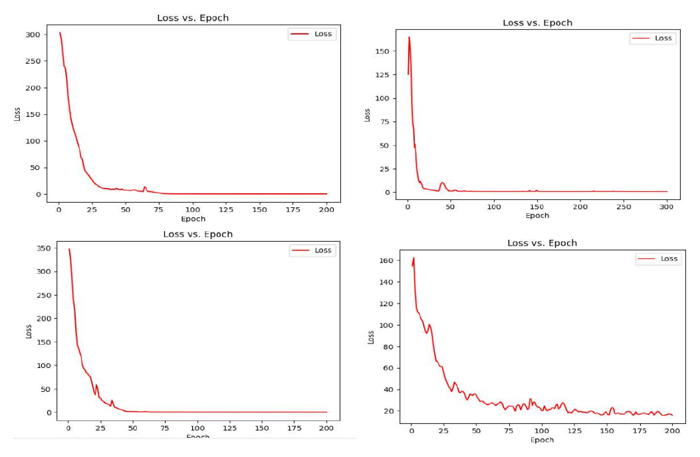

*Figure 3. Loss-versus-epoch curves from four experimental runs. The curves demonstrate rapid early optimization and different residual convergence behavior.*

A separate 500-epoch run also falls sharply at the beginning, reaches a low range later in training, and exhibits intermittent spikes during the final part of the run.

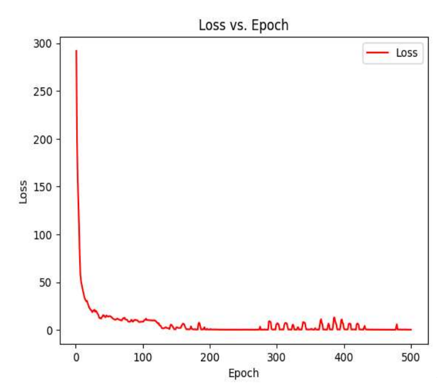

*Figure 4. Training loss over 500 epochs. The objective decreases substantially, with occasional late-stage spikes.*

The experiment record does not preserve a complete per-curve configuration or a separate validation-loss trace. The curves therefore demonstrate optimization behavior but are not used to rank model variants.

### 8.3 Input-Resolution Experiment

Higher-resolution inputs preserved more fine-scale spatial structure and clearer boundaries. Aggressive downsampling removed detail and produced less stable depth maps. Some low-resolution runs required close to 500 epochs to reach a stable result.

The improvement in detail came with higher GPU-memory consumption and longer processing time. Reducing image size or transformer depth lowered memory use but also reduced output detail.

### 8.4 Transformer Initialization Experiment

Pretrained transformer initialization converged faster than random initialization and produced better qualitative outputs in the recorded runs. This result supports the use of transferable visual representations when the available depth-training data is limited.

### 8.5 Loss-Composition Experiment

The most stable behavior was observed when photometric reconstruction, SSIM, and edge-aware smoothness were used together. Photometric loss aligned reconstructed and target pixels, SSIM preserved structural information, and smoothness regularized local depth variation.

The smoothness weight required careful tuning. When weighted too strongly, it introduced artifacts near high-contrast boundaries and reduced fine detail.

### 8.6 Qualitative Depth Predictions

The model was applied to images with animals, landscapes, city scenes, crowds, indoor spaces, repetitive structures, and underwater imagery.

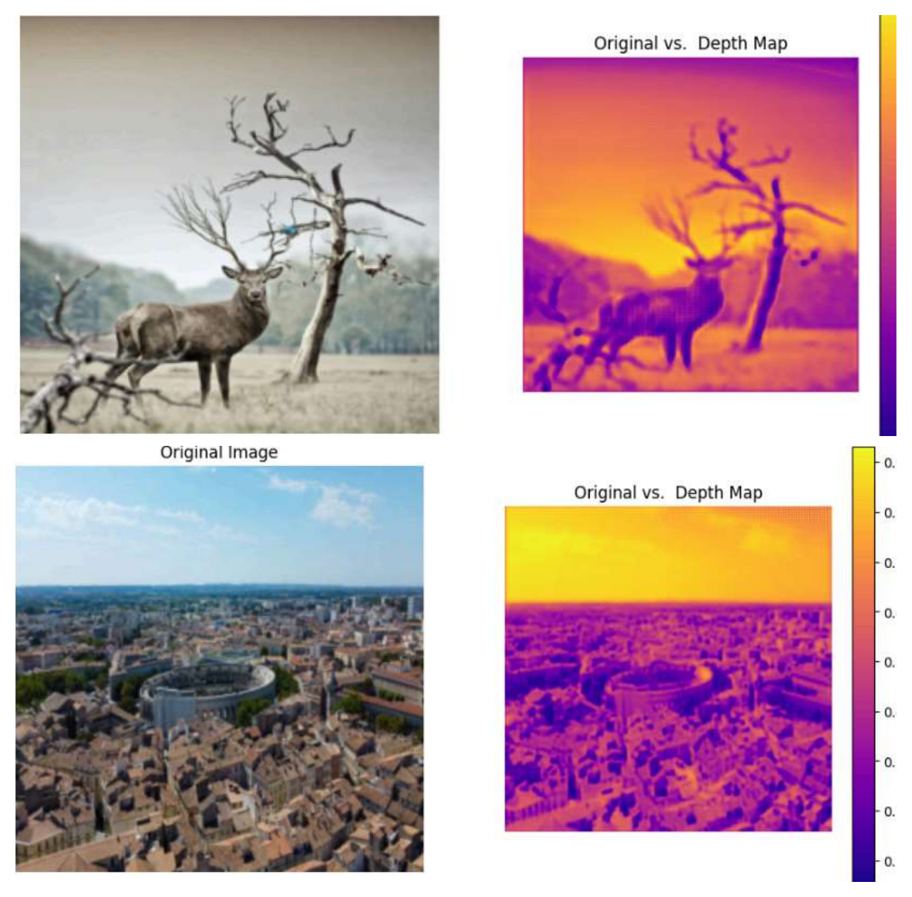

*Figure 5. Representative depth predictions for an animal scene and a wide urban landscape.*

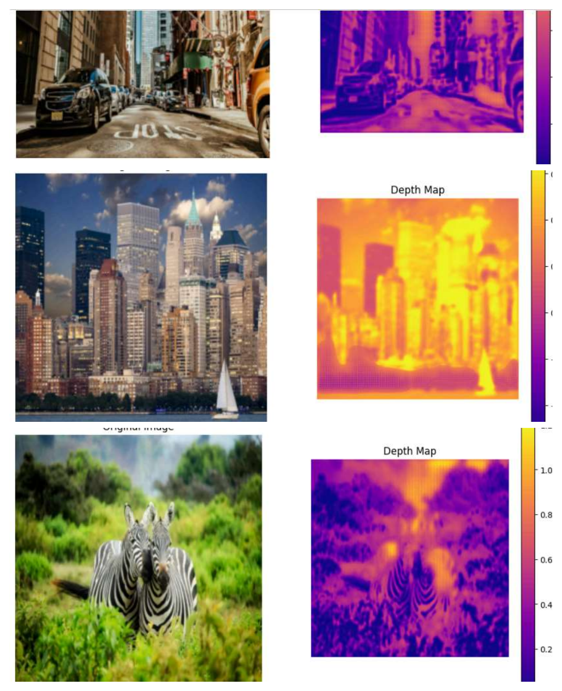

*Figure 6. Additional results across street, skyline, and animal scenes.*

Across the displayed examples, the predictions frequently preserve large-scale spatial organization, including separation between sky and ground, foreground objects and backgrounds, and major structural boundaries. Fine details remain more difficult in crowded scenes, repetitive textures, thin structures, low-texture regions, and strong illumination transitions.

The color maps represent relative depth or disparity. Their scales are not calibrated consistently across all images, so values should not be compared directly between figures.

### 8.7 Bilateral Filtering and Visualization

Bilateral filtering was applied as optional post-processing. The filter reduces local high-frequency variation while attempting to preserve major boundaries.

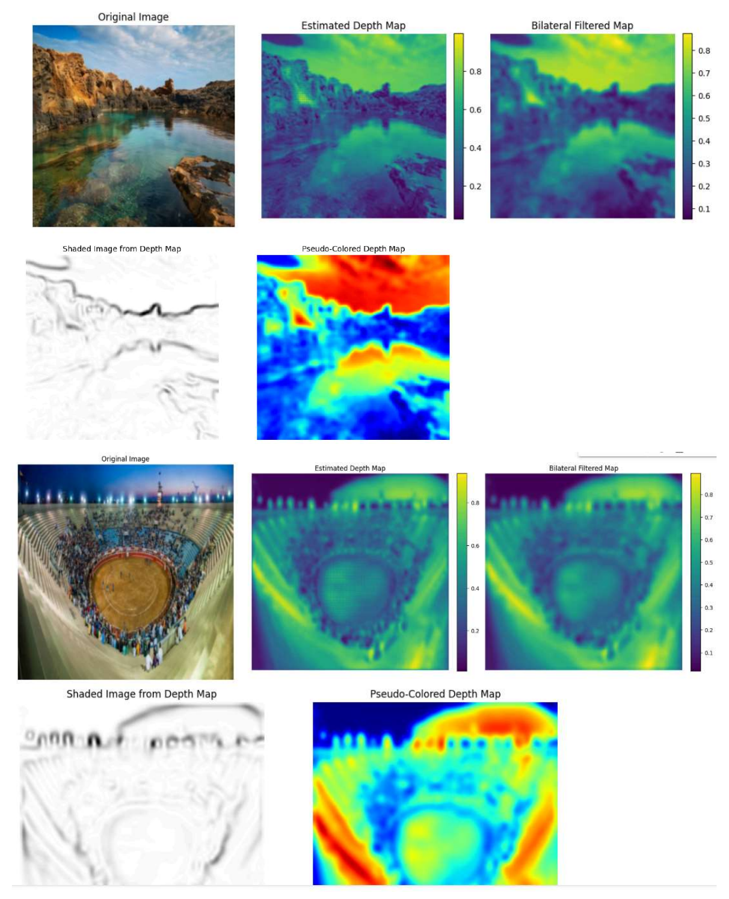

*Figure 7. Raw prediction, bilateral-filtered prediction, shaded visualization, and pseudo-colored visualization.*

The comparison shows that bilateral filtering produces visually smoother maps. Strong filtering can also soften thin structures and depth discontinuities. Shaded and pseudo-colored outputs improve interpretability but do not change the underlying depth accuracy.

### 8.8 Extended Qualitative Gallery

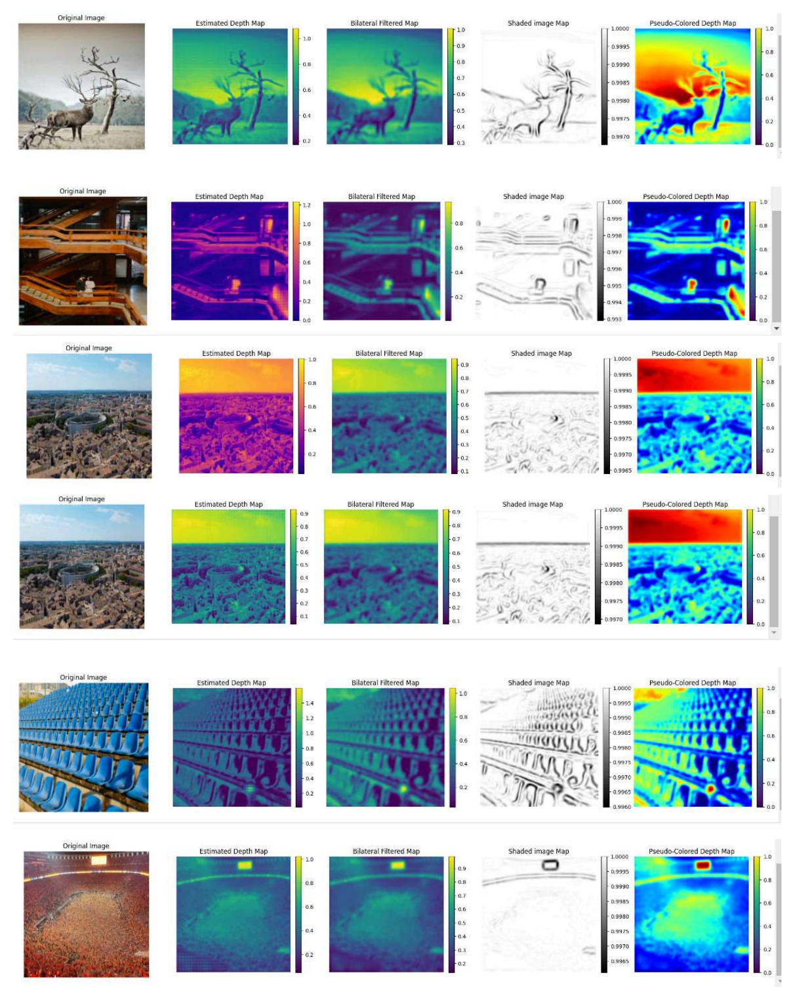

*Figure 8. Animal, architectural, aerial, repetitive-pattern, and crowd scenes.*

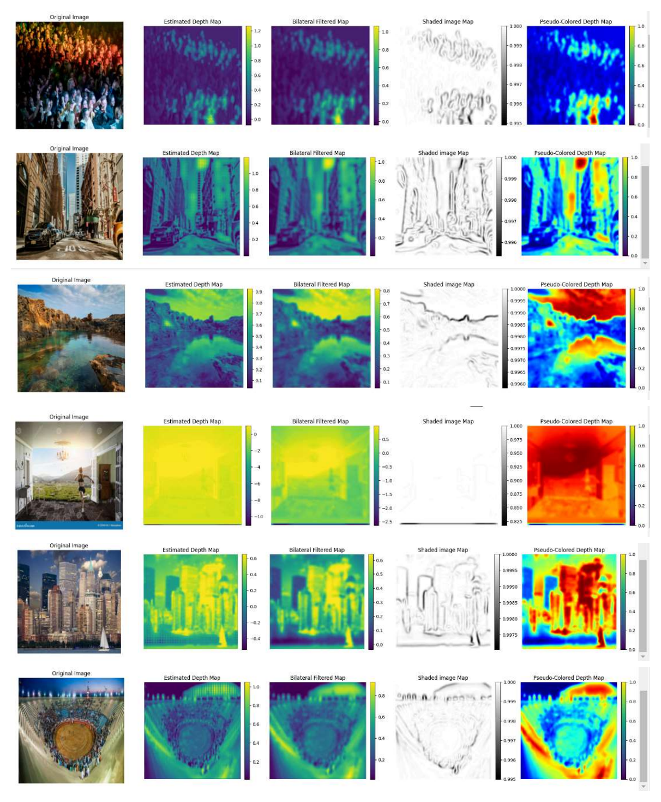

*Figure 9. Crowd, street, landscape, indoor, skyline, and stadium scenes.*

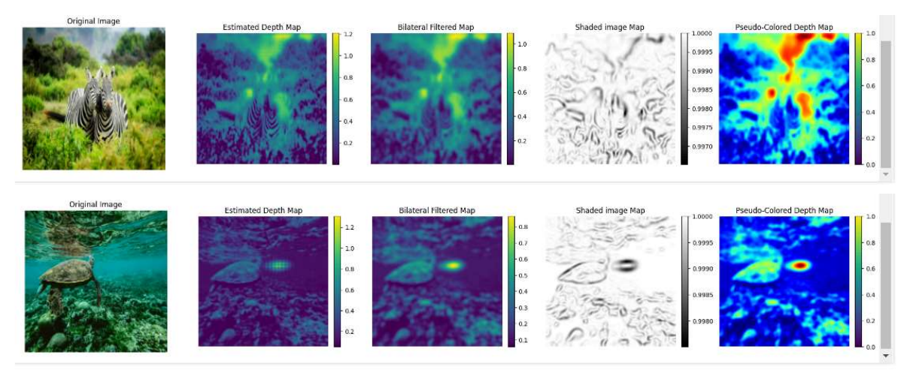

*Figure 10. Zebra and underwater turtle scenes.*

### 8.9 500-Epoch Multi-View Experiment

A 500-epoch multi-view experiment produced a depth map that retained the dominant animal and branch structure. Bilateral filtering generated a smoother version of the same prediction.

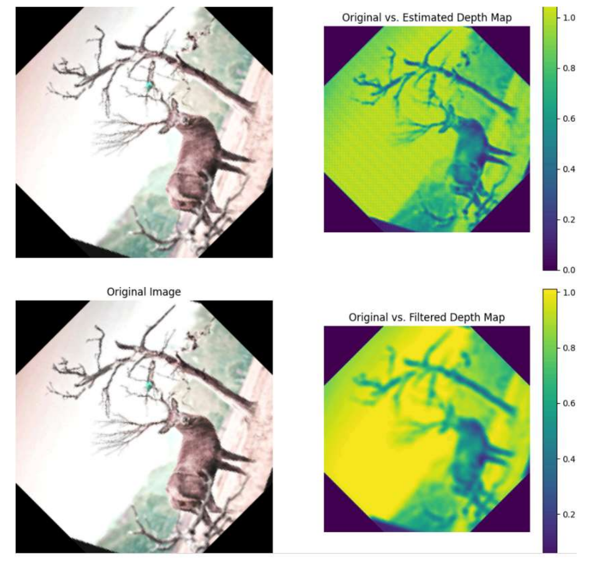

*Figure 11. Raw and bilateral-filtered outputs from the 500-epoch multi-view experiment.*

### 8.10 Results Scope

The experiment record includes training-loss curves and qualitative depth visualizations, but it does not include a fixed train/validation/test split, exact sample counts for each run, per-run random seeds, or standard depth metrics. The results therefore establish optimization behavior and qualitative scene-structure learning, not benchmark depth accuracy.

---

## 9. Quantitative Evaluation Metrics

When ground-truth depth is available, the evaluation script reports the following standard metrics.

### 9.1 Absolute Relative Error

$$
\operatorname{AbsRel} = \frac{1}{N}\sum_i\frac{|d_i-\hat{d}_i|}{d_i}.
$$

### 9.2 Squared Relative Error

$$
\operatorname{SqRel} = \frac{1}{N}\sum_i\frac{(d_i-\hat{d}_i)^2}{d_i}.
$$

### 9.3 Root Mean Squared Error

$$
\operatorname{RMSE} = \sqrt{\frac{1}{N}\sum_i(d_i-\hat{d}_i)^2}.
$$

### 9.4 Log RMSE

$$
\operatorname{RMSE}_{\log} = \sqrt{\frac{1}{N}\sum_i\left(\log d_i-\log\hat{d}_i\right)^2}.
$$

### 9.5 Threshold Accuracy

$$
\delta_k:\quad \max\left(\frac{\hat{d}_i}{d_i},\frac{d_i}{\hat{d}_i}\right)<1.25^k.
$$

Because monocular self-supervised depth has global-scale ambiguity, the evaluation implementation supports median scaling before metric computation.

---

## 10. Implementation

The project is implemented in PyTorch and organized into separate model, loss, geometry, dataset, evaluation, and visualization modules.

```text
models/
  vit_encoder.py       # patch embedding and transformer blocks
  depth_decoder.py     # multi-scale convolutional decoder
  depth_model.py       # end-to-end depth model
  pose_net.py          # relative camera pose estimation
  cnn_baseline.py      # convolutional comparison model
losses/
  ssim.py
  photometric.py
  smoothness.py
  self_supervised.py
geometry/
  projection.py        # depth conversion, SE(3), projection, and warping
datasets/
  triplet_dataset.py   # target/source frame loading
utils/
  metrics.py           # standard depth metrics
scripts/
  train.py
  evaluate.py
  predict.py
```

### 10.1 Training Input

Self-supervised training uses temporally adjacent frames and camera intrinsics:

```csv
prev,target,next,fx,fy,cx,cy
sequence/000000.png,sequence/000001.png,sequence/000002.png,721.5,721.5,609.6,172.9
```

### 10.2 Inference

After training, a single RGB image is sufficient to generate a depth prediction.

---

## 11. Limitations

- Absolute metric scale is not available from monocular self-supervision without additional information.
- Dynamic objects, occlusions, reflections, and non-Lambertian surfaces can violate photometric reconstruction assumptions.
- High-resolution transformer models require substantial GPU memory.
- The recorded experiment runs do not include a fixed benchmark protocol or standard depth metrics.
- Bilateral filtering improves smoothness but can reduce fine boundary detail.
- A production benchmark requires dataset-specific cropping, intrinsic rescaling, dynamic-object handling, checkpoint metadata, and reproducible train/validation/test splits.

---

## 12. Future Work

1. Train and evaluate the full pose-and-warping pipeline on a fixed KITTI split.
2. Add minimum reprojection, auto-masking, occlusion handling, and dynamic-object masking.
3. Compare CNN, standard ViT, and hierarchical transformer encoders such as Swin Transformer.
4. Evaluate pretrained and randomly initialized encoders under matched conditions.
5. Add temporal consistency and temporal-attention experiments.
6. Measure model size, peak GPU memory, latency, and throughput at several resolutions.
7. Explore pruning, quantization, knowledge distillation, and lightweight transformer variants.
8. Extend visualization to calibrated three-dimensional point clouds when valid intrinsics and metric depth are available.

---

## 13. Conclusion

This project demonstrates a complete architectural path for self-supervised monocular depth estimation with Vision Transformers. A transformer encoder captures global image relationships, a convolutional decoder recovers dense multi-scale predictions, and geometric view synthesis provides a training signal from unlabeled image sequences.

The experiments show substantial reductions in the training objective across several runs, faster convergence with pretrained transformer initialization, improved detail at higher image resolutions, greater stability from a composite photometric/SSIM/smoothness objective, and smoother visual output after bilateral filtering. Qualitative results across varied scene categories retain useful large-scale depth organization while also exposing challenges around fine boundaries, repetitive textures, low-texture regions, and memory consumption.

The work provides a practical PyTorch foundation for further benchmark evaluation, loss ablation, model-efficiency studies, and robotics or autonomous-navigation applications.
